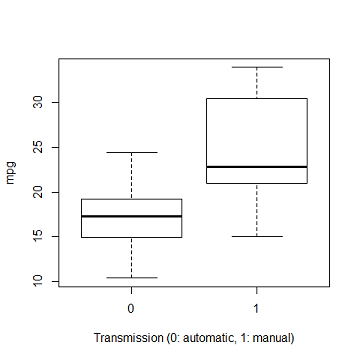
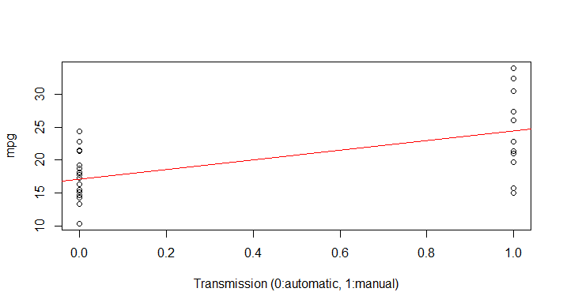
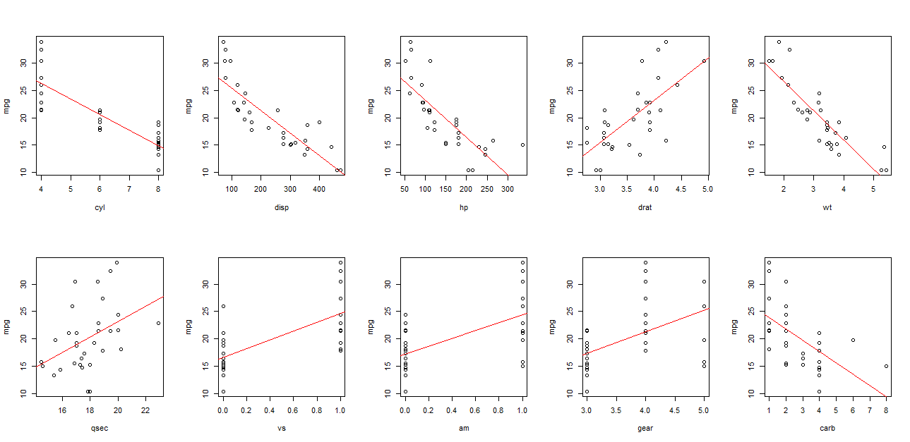
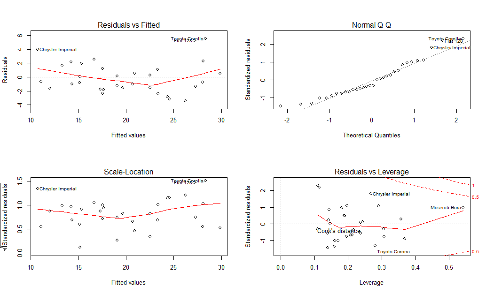

Linear Regression: Course Project
========================================================
## Question

You work for Motor Trend, a magazine about the automobile industry. Looking at a data set of a collection of cars, they are interested in exploring the relationship between a set of variables and miles per gallon (MPG) (outcome). They are particularly interested in the following two questions:

- "Is an automatic or manual transmission better for MPG"
- "Quantifying how different is the MPG between automatic and manual transmissions?"

Take the **mtcars** data set and write up an analysis to answer their question using regression models and exploratory data analyses.

## Executive Summary

Given the data, it becomes apparent that the mpg of a car depends on several factors and not just its transmission. In the following, we determine the parameters most relevant to affecting a car's fuel efficiency. Considering all those parameters and doing a *fair* analysis, we deduce that manual transmission results in a 1.375 mpg boost on average. In conclusion, we think that manual transmission is better than automatic transmission in terms of fuel efficieny for an *average* car.

## Detailed Analysis
### 1. Preliminary fitting
A first-cut plot of mpg (fuel efficiency) versus transmission type shows that even though manual transmission is better than automatic transmission on the median, it is not necessarily always better - there are some cars with automatic transmission that have a higher mpg that cars with manual transmission (see Figure 1). For instance, the Hornet Sportabout (automatic) has a mileage of 18.7 while the Ford Pantera L (manual) has a mileage of 15.8.

When we linearly fit 'mpg' with respect to 'am' alone, (see Figure 2) we get the following fitting parameters:
```{r}
Slope=7.245,Intercept=17.147
```
On *average*, manual transmission gives us 7.245 more mpg, i.e., it does better than automatic transmission.

### 2. Exploratory Analysis
In the above fit, we have disregarded all the parameters in the dataset except 'am'. However, when we plot mpg versus all the other available parameters, we do notice that the mpg is correlated with several other variables as well (see **Figure 3** in the appendix for our exploratory analysis). For instance, notice that as 'wt' increases, 'mpg' decreases, and the two variables appear strongly correlated. Likewise, we as 'drat' increases, 'mpg' also increases. There are also some variables that do not seem to be well-correlated with 'qsec'. While variables like 'cyl','wt','disp','hp' and 'drat' are seen to be strongly correlated with 'mpg', variables like 'qsec','gear' and 'carb' appear to be less correlated. The next step in our analysis is to determine the variables in the dataset (other than 'am') that we want to consider for fitting. This is very important in order to correctly answer the aforementioned problem.

### 3. A more reasonable fit
We use the anova() function to determine the more relevant variables to mpg.

```
Analysis of Variance Table

Response: mpg
          Df Sum Sq Mean Sq  F value    Pr(>F)    
cyl        1 817.71  817.71 116.4245 5.034e-10 ***
disp       1  37.59   37.59   5.3526  0.030911 *  
hp         1   9.37    9.37   1.3342  0.261031    
drat       1  16.47   16.47   2.3446  0.140644    
wt         1  77.48   77.48  11.0309  0.003244 ** 
qsec       1   3.95    3.95   0.5623  0.461656    
vs         1   0.13    0.13   0.0185  0.893173    
am         1  14.47   14.47   2.0608  0.165858    
gear       1   0.97    0.97   0.1384  0.713653    
carb       1   0.41    0.41   0.0579  0.812179    
Residuals 21 147.49    7.02                       
```

The above table agrees with the inference that 'cyl', 'wt', 'disp', 'drat' and 'hp' are also important variables to consider along with 'am'. All these variables have comparable F values to that for 'am'. With this analysis, we are ready to create our new, and more reliable fit with the variables 'cyl', 'wt', 'disp', 'drat', 'hp' and 'am'. The fit summary yields the following
```
Coefficients:
            Estimate Std. Error t value Pr(>|t|)    
(Intercept) 36.04938    7.60553   4.740 7.31e-05 ***
cyl         -1.03335    0.72405  -1.427  0.16590    
wt          -3.27472    1.15685  -2.831  0.00903 ** 
disp         0.01257    0.01195   1.052  0.30307    
drat         0.48586    1.49495   0.325  0.74788    
hp          -0.02887    0.01444  -1.999  0.05658 .  
am           1.37506    1.56866   0.877  0.38906    
```

### 4. Inference
The adjusted R-squared value is 82.11% meaning that 82% of the error variance is accounted for in the model, and the p-value is 2.266e-9. More importantly, with regards to the question at hand, the slope estiamte for the 'am' variable reads 1.375. This means that when the other important variables (cyl, wt, disp, drat and hp) are help constant, manual transmission is still better and provides a 1.375 mpg boost on average. The standard error on the slope is also high as a result of some outliers.

### 5. Residual plot and diagnostics
Figure 4 plots the residuals. They indicate the dependency of residuals on the fitted values. The residual QQ-plot depicts the normality of the errors. Also, there are some data points that havea large influence on the fit itself.

For diagnosis, we list the cars with the highest dfbeta vaues
```
Toyota Corona  Fiat 128   Chrysler Imperial 
  0.6016051    0.4339466       0.2342634
```
and the cars with the highest leverage (hatvalues)
```
Maserati Bora  Ford Pantera L   Honda Civic 
  0.5411440      0.3684456      0.3571702
```

These names appear in the residual plots (Figure 4) as well, confirming that our analysis is correct.

### Appendix



**Figure 1**: A box plot of mpg versus transmission for the mtcars dataset.. One cannot definitively say that manual transmission *always* does better.



**Figure 2**: On *average*, manual transmission gives us 7.245 more mpg when all other variables are disregarded.



**Figure 3** This plot reveals that mpg is correlated to variables other than 'am' as well. It is critical to consider the important variables while making the fit.



**Figure 4** Residual plots.